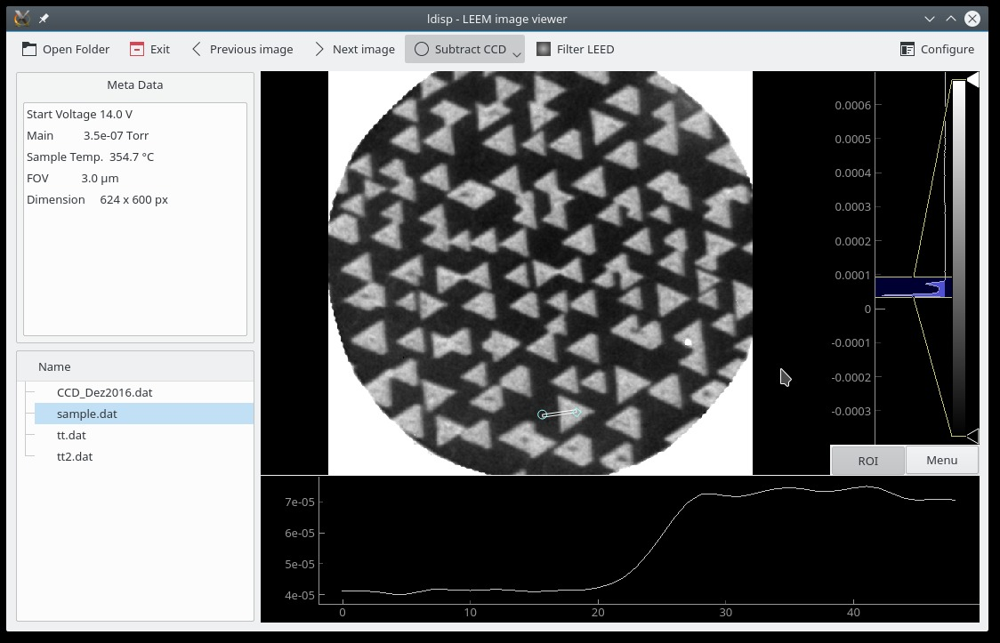

## ldisp - A LEEM image viewer
ldisp is a python based LEEM image viewer. It is intended to be easy 
to use and for quick inspection of UView LEEM images and corresponding metadata.

The ldisp provides a file tree view for fast data browsing and displays 
the metadata and the image. Moreover it provides basic corrections
like CCD subtraction and filtering (usually only used to reduced the inelastic 
diffraction peak). Thanks to the pyqtgraph package 2D profiles along arbitrary
directions and export to various image formats are supported.

Tested on Linux (Ubuntu 16.04 and OpenSuse).

## Requirements
- Python3
- PyQt5
- [pyqtgraph](www.pyqtgraph.org) >= v.0.10
- numpy
- [LEEMImage](www.github.com/jhoecker/pyLEEMImage)

## Author
- Jan Höcker

## License
- GPLv3
